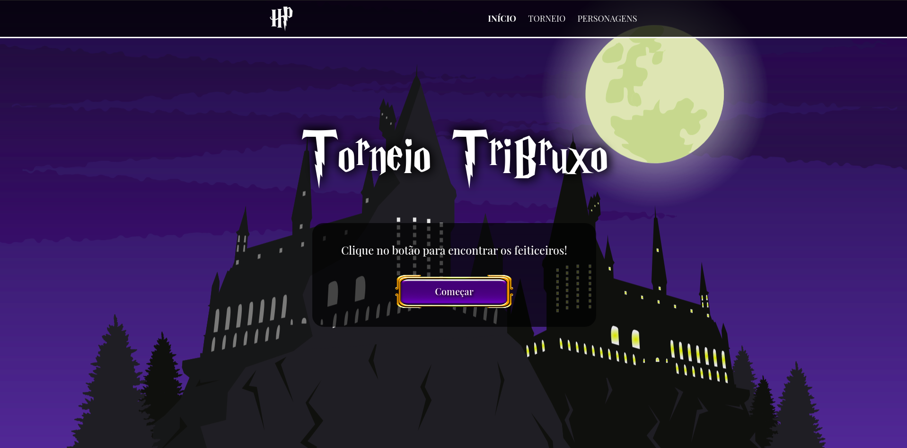

<p align="center">
  
</p>
<br>
<hr>
<br>

<h2 align="center">
  Projeto: Torneio TriBruxo
</h2>
<br>

<blockquote align="center">“Algumas pessoas sonham com o sucesso. Enquanto isso outras acordam e trabalham duro para isso.”

(Mark Zuckerberg)</blockquote>
<br>


<p align="center">

  <a href="LICENSE">
    
  </a>
  <a href="NPM">
    
  </a>
  <a href="GitHub followers">
    
  </a>
</p>
<hr>
<br>
<br>

# :rocket: Sobre o projeto

O Torneio TriBruxo é um projeto realizado com a intenção de treinar mais sobre a construção de aplicações em ReactJS, o consumo de APIs externas e animações avançadas com uso de Greensock. 

Nele consultamos um API pública do Harry Potter, e fazemos uma brincadeira com o tema Torneio TriBruxo, presente na série, sorteando aleatoriamente três alunos sempre de diferentes casas para disputar o torneio. 

**O Foodfy é o projeto realizado dentro do curso de desenvolvimento full-stack da Kenzie Academy Brasil.**

<br>

## :computer: Tecnologias utilizadas
A seguinte stack foi utilizada na construção do projeto:

- ReactJS
- APIs
- GreenSock

<br>

## :construction_worker: Instalação

**Primeiramente você precisa ter instalado o [Node.js](https://nodejs.org/en/download/), depois efetuar o clone deste repositório a partir do seguinte comando:**

```
git clone https://github.com/BrunoBelarminoNog/torneio-tribruxo.git
```

URLs SSH fornecem acesso a um repositório Git via SSH, um protocolo seguro. Se você tiver uma chave SSH registrada em
sua conta do Github, clone o projeto usando este comando:

```
git clone git@github.com:BrunoBelarminoNog/torneio-tribruxo.git
```

**Instale as dependências**

```
yarn || npm install
```


**Inicie o servidor**

```
yarn start || npm start
```


<br>


# :art: Layout

<br />
<p align="center">
  
</p>
<br />


# :pushpin: Contribuindo

Sinta-se à vontade para registrar um novo problema com o respectivo título e descrição no repositório Foodfy . Se você já encontrou uma solução para o problema, eu adoraria revisar sua solicitação de pull!

Verifique a página de contribuição para ver os melhores lugares para registrar problemas, iniciar discussões e começar a contribuir.


# :unlock: Licença
Lançado em 2020. Este projeto está sob a licença do MIT .

Feito com muita dedicação por Bruno Belarmino :zap:

Me siga nas redes! [LinkdIn](https://www.linkedin.com/in/bruno-belarmino-nog/)
